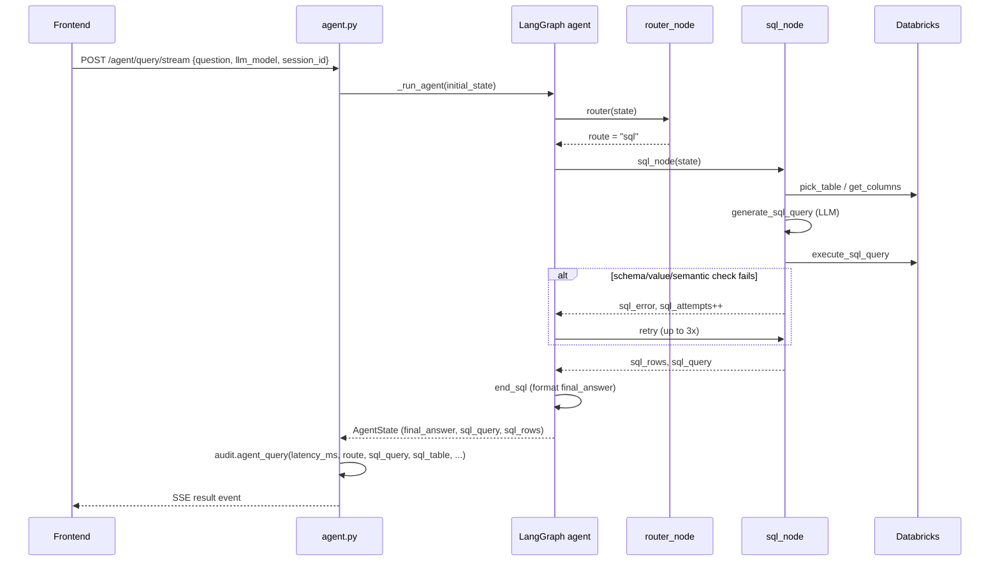
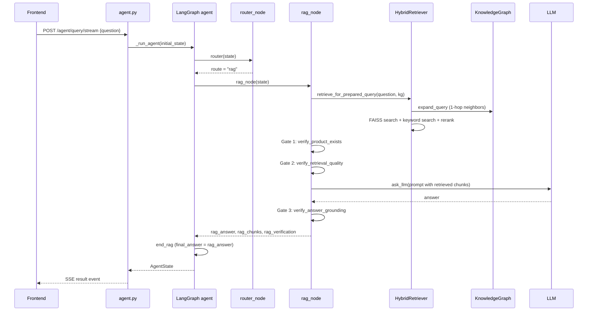
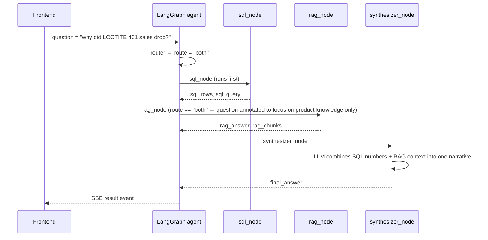
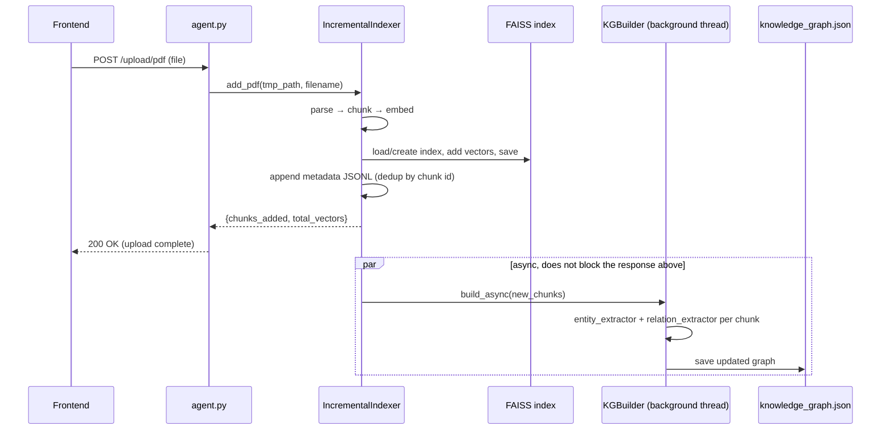

# Architecture

## System overview

The Analytics System is a natural-language interface over two very
different knowledge sources — a Databricks warehouse (structured sales/
inventory data) and a library of product datasheets (PDFs) — unified
behind a single chat interface. A user asks a question in plain English;
the system decides whether it needs structured data (Text2SQL), document
knowledge (RAG), both, or neither (schema introspection), executes the
appropriate pipeline(s), and returns a grounded answer along with the SQL
query used, the source chunks retrieved, and a routing explanation.

```
┌────────────┐      SSE / REST      ┌──────────────────────────┐
│  Frontend  │ ───────────────────► │   FastAPI (agent.py)     │
│  (React)   │ ◄─────────────────── │   /agent/query(/stream)  │
└────────────┘                      └────────────┬─────────────┘
                                                  ▼
                                     ┌──────────────────────────┐
                                     │  LangGraph agent          │
                                     │  router → sql/rag/both/   │
                                     │  schema → synthesizer     │
                                     └──┬────────────────────┬──┘
                          ┌─────────────┘                    └─────────────┐
                          ▼                                                ▼
              ┌───────────────────────┐                     ┌──────────────────────────┐
              │ Text2SQL pipeline      │                     │ RAG pipeline              │
              │ Databricks + hybrid    │                     │ FAISS + keyword +         │
              │ value index + MDL      │                     │ knowledge graph            │
              └───────────────────────┘                     └──────────────────────────┘
```

Two supporting subsystems apply everywhere: **auth** (role-based table/
document access, applied to `AgentState` before the graph runs) and
**observability** (in-house latency + structured logging, no external
tracing service — see `observability/audit_logger.py`).

## Components

| Layer | Component | Responsibility |
|---|---|---|
| Frontend | `pages/ChatPage.tsx` → `components/AgentChat.tsx` | Chat UI, route badge, progress checklist, results table |
| Frontend | `hooks/useChat.ts` | Chat state, SSE consumption, session persistence |
| Frontend | `services/apiClient.ts` | Single HTTP/SSE gateway (auth header, timeouts, error shaping) |
| Backend API | `backend/services/api/agent.py` | FastAPI app; `/agent/query`, `/agent/query/stream`, `/upload/pdf`, `/upload` (CSV), `/login`, health checks |
| Agent | `backend/services/agent/graph.py` | LangGraph `StateGraph` wiring router → pipeline nodes → synthesizer |
| Agent | `nodes/router.py` | Classifies the question into `sql` \| `rag` \| `both` \| `schema` |
| Agent | `nodes/sql_node.py` | Text2SQL with a 3-attempt self-correction loop |
| Agent | `nodes/rag_node.py` | Hybrid retrieval + 3-gate verification + generation |
| Agent | `nodes/schema_node.py` | Direct table-listing answers, bypasses the LLM entirely |
| Agent | `nodes/synthesizer.py` | Merges SQL rows + RAG answer into one narrative for `both` |
| Text2SQL | `db/databricks_service.py` | PAT-authenticated Databricks SQL connector |
| Text2SQL | `indexing/{column_profiler,value_canonicalizer,inverted_index,hybrid_value_index,entity_matcher}.py` | Auto-generated index of DB values for filter validation (Milestone 2) |
| Text2SQL | `mdl/{mdl_loader,mdl_enricher}.py` | Semantic layer — metric/join synonyms from `backend/mdl/schema.yaml` |
| Text2SQL | `generation/sql_hallucination_guard.py` | Schema/semantic/value/empty-result checks that drive retries |
| RAG | `indexing/{parser,chunker,embedded,indexer,incremental}.py` | PDF → chunks → embeddings → FAISS index (batch + per-upload); see `docs/knowledge_prep_design.md` |
| RAG | `kg/{entity_extractor,relation_extractor,knowledge_graph,kg_builder}.py` | Entity/relation extraction into a NetworkX knowledge graph |
| RAG | `retrieval/{hybrid_retriever,keyword_retriever,kg_retriever,reranker,vector_store}.py` | Query-time retrieval: KG expansion + FAISS + keyword search + rerank |
| RAG | `rag_verifier.py` | 3-gate verification: product exists → retrieval quality → answer grounding |
| Auth | `auth/{auth_service,permission_auth,rbac,user_context}.py` | JWT-style tokens, role-based table/RAG-source denylists, injected into `AgentState` |
| Observability | `observability/audit_logger.py`, `observability/logs/` | Structured JSON logs: latency, route, sql_query, sql_table, session_id, user_id, llm_model |

## Request workflow

1. **Frontend** (`useChat.ts`) sends `POST /agent/query/stream` with
   `{question, llm_model, history, session_id}`.
2. **`agent.py`** builds an `AgentState` dict, applies auth (`verify_token`
   → `user.adjust_agent_state()` injects `denied_tables` /
   `denied_rag_sources`), registers a per-session progress queue
   (`agent/progress.py`), and invokes the compiled LangGraph agent in a
   background thread so the event loop isn't blocked.
3. **Graph nodes** (see [Routing logic](#routing-logic)) emit progress
   events (`_progress(session_id, step, label)`) as they run — these
   stream to the frontend as SSE `progress` events and render as a
   checklist while the query is in flight.
4. When the graph reaches `END`, the final `AgentState` is packaged into
   an SSE `result` event (or returned directly as JSON for the
   non-streaming `/agent/query` endpoint) containing `route`,
   `final_answer`, `sql_query`, `sql_rows`, `rag_chunks`,
   `rag_verification`, and `error`.
5. **`_run_agent()`** wraps the whole invocation in a `time.perf_counter()`
   timer and writes one structured record via `audit.agent_query(...)` to
   `observability/logs/audit.log` (question, route, sql_query, sql_table,
   session_id, user_id, llm_model, latency_ms) — no external tracing
   service is involved.
6. The frontend swaps the loading bubble for the final message, rendering
   the route badge, results table (SQL), verification warnings (RAG), and
   feedback controls.

PDF uploads (`POST /upload/pdf`) follow a separate, shorter path:
parse → chunk → embed → merge into the FAISS index synchronously, then
kick off knowledge-graph construction (`KGBuilder.build_async`) in a
background thread so the HTTP response isn't blocked on graph extraction.

## Data flow

```
Databricks tables ──► column_profiler / value_canonicalizer / inverted_index
                       (Milestone 2 hybrid index — schema + value validation)
                                      │
                                      ▼
                            sql_node (pick table, generate SQL,
                            validate against index, execute, retry)
                                      │
backend/mdl/schema.yaml ─► mdl_enricher (metric/join synonyms injected
                            into the SQL generation prompt)

PDFs ──► parser → chunker → embedder → FAISS index  (see
         docs/knowledge_prep_design.md for full detail)
              │
              └──► kg_builder → entity/relation extraction → knowledge_graph.json
                                      │
                                      ▼
                            rag_node (KG query expansion → hybrid
                            retrieval → 3-gate verification → generation)

Both pipelines' outputs ──► synthesizer (route == "both" only) ──► final_answer
                                      │
                                      ▼
                     observability/audit_logger.py → observability/logs/audit.log
```

Auth data flows orthogonally: `auth/users.db` (SQLite) → `verify_token()`
→ `UserContext.adjust_agent_state()` injects `denied_tables` /
`denied_rag_sources` into `AgentState` *before* the graph runs, so
`sql_node` and `rag_node` enforce access control directly rather than
filtering results after the fact.

## Routing logic

`nodes/router.py` decides the pipeline for every question, in this order:

1. **Schema fast path** — a regex bank (`_SCHEMA_PATTERNS`) matches
   questions like "what tables do you have" / "list all data" and routes
   directly to `"schema"` **without calling the LLM at all**.
2. **LLM classification** — otherwise, the user's selected model is asked
   to classify the question as:
   - `"sql"` — structured data question (counts, sums, lists, comparisons)
   - `"rag"` — knowledge/document question (specs, how-to, explanations)
   - `"both"` — needs data **and** knowledge (e.g. "why did sales of
     LOCTITE 401 drop this quarter?")
   The LLM is asked to return `{"route": ..., "reasoning": ...}`; the
   parser strips `<think>` blocks and code fences, then tries JSON first,
   falling back to a bare-word search (`"both"` checked before `"rag"`
   before `"sql"`, since it's the most specific).
3. **Keyword fallback** — if the LLM call raises (bad model, quota,
   timeout), a keyword-overlap heuristic decides the route instead:
   `_SQL_KEYWORDS` vs `_RAG_KEYWORDS` are counted in the question; both
   present → `"both"`, more RAG hits → `"rag"`, otherwise → `"sql"`. This
   is also why `route_reasoning` sometimes reads *"error in router — used
   keyword fallback"* — it's a real degraded path, not a bug.

Post-routing, `graph.py`'s conditional edges decide node order:

- `"sql"` → `sql_node` → (retry up to 3× on error) → `end_sql`
- `"rag"` → `rag_node` → `end_rag`
- `"both"` → `sql_node` → `rag_node` → `synthesizer` (SQL always runs
  first; `should_retry_sql` / `should_continue_after_rag` check whether
  the other pipeline has already run before deciding to advance)
- `"schema"` → `schema_node` → `END` directly (no LLM, no retries)

Both `sql_node` and `rag_node` have their own internal gating on top of
the graph-level routing: `sql_node` runs schema/semantic/value validation
after every SQL generation attempt and retries with the specific error
fed back into the prompt; `rag_node` runs a 3-gate verification
(`verify_product_exists` → `verify_retrieval_quality` →
`verify_answer_grounding`) and returns an early refusal if gate 1 or 2
fails, or a caveated answer if gate 3 (grounding) fails.

## Sequence diagrams

### SQL-only query



### RAG-only query



### Hybrid ("both") query



### PDF upload → knowledge graph build


